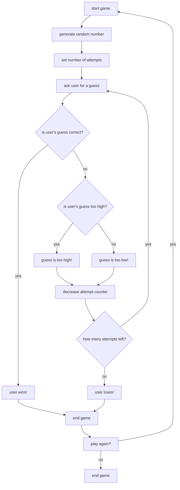

```mermaid
flowchart TD
    A[start game] --> B[generate random number]
    B --> C[set number of attempts]
    C --> D[ask user for a guess]
    D --> E{is user's guess correct?}
    E -- yes --> F[user wins!]
    F --> G[end game]
    E -- no --> H{is user's guess too high?}
    H -- yes --> I[guess is too high!]
    H -- no --> J[guess is too low!]
    I --> K[decrease attempt counter]
    J --> K[decrease attempt counter]
    K --> L{how many attempts left?}
    L -- yes --> D
    L -- no --> M[user loses!]
    M --> G
    G --> N[play again?]
    N -- yes --> A
    N -- no --> O[end game]
```
